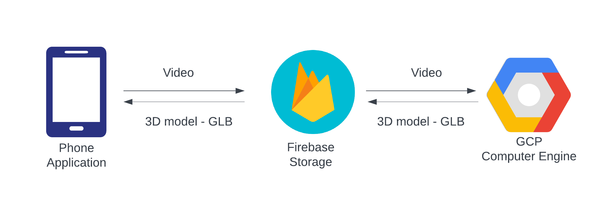

# Inspiration

Since 2020, with the introduction of neural radiance fields (NeRFs), it has been possible to construct super realistic 3D models of real scenes captured from a camera. NeRFs achieved unprecedented effectiveness at this task, and an explosion of research in this idea has taken off since (currently 4000+ citations on the original NeRF paper). 

To keep up with the huge interest in research, open source efforts have taken place to standardize the process of working with NeRFs for researchers. Because of this, any computer vision enthusiast is able to generate photometrically accurate models using camera data they collect themself. Furthermore, there are currently mobile apps that do the entire NeRF pipeline end-to-end, from collecting a video recording taken on a mobile phone to then outputting the generated 3D model of the scene. Because of these apps, a person doesn’t have to understand the underlying technology in order to benefit. However, these tools are paywalled/require recurring subscriptions to be used. 

With the explosive pace in NeRF research, furthermore, it’s difficult for a single app to keep up with everything that’s out there. This is where open source tools reign supreme, as an entire community is able to contribute towards making the tool as best as it can be. 

# What is VidStruction?

*Vid Struction* is an open-source platform that allows you to scan the word around you and create accurate 3D models using just your phone. We do this by leveraging state of the art NeRF models. The best part is that there is no black-boxed AI model, the platform is completely scalable and 100% open source (which means its FREEE) !!!

# How do we do this?

Overview of project design

It starts out with an intervactive front end where you can takea video of the object or scene you wish to take a video of. Or you could also use your fancy LIDAR capabale phones to upload point clouds. After which, these are being uploaded to Firebase. Meanwhile, the GCP Compute Engine hosts the NeRF model. The video/point clouds are forwarded to GCP where it firs undergoes some pre processing. Our demo focuses on the pipeline built for videos. Thus, the video undergoes come pre-processing which involves extracting frames from it, which is then used to calculate camera poses, intrinsinc and extrinsic matrices uses *Colmap*. All this information is then used to train a NeRF model using *NerfStudio*. The model outputs a point cloud which is converted to a GLB file during post-processing and passed to Firebase which is then rendered on your phone! 

# How to use VidStruction?
A user starts off by either choosing a video of any object from their gallery or recording an object using an in-built camera software. After this, the video is then pipelined through Firebase and into GCP where a NeRF model renders the video into a 3D model of the object. This is then sent back through firebase as a GLB file and is shown in the app as interactive model. This file can be further be used for analysis or CAD purposes.

# Challenges we ran into...

This is a tough one. There were several hurdles for us to jump over. Our main aim was to keep the project open-source, modular and scalable with the use of the least number of external resources. For the sake of the development speed and time crunch, we utilised Firebase as our means of communicating to GCP. However, in an ideal world, we would like to leverage SSH to do so. SSH has several benifits, chief among which is modularity. Furthermore, our pipeline while completely setup, needs to be automated. Creating each step in out pipeline takes a lot of time and automating it would have been possible given more time.

# Accomplishments that we're proud of

We are extremely proud that we survived and created a somewhat working product! It’s extremely impressive that any shred of sanity remains in any of us after so many grueling hours of debugging nightmares! For actual project goals, we're quite happy that the mobile app works consistently. Furthermore, connecting a GCP compute engine to firebase turned out to be more annoying than expected, so getting the endpoint connection working for that was also really rewarding! In general, seeing that we were able to accomplish each individual step of our pipeline (although, not all steps occurring automatically yet) gives us a confidence boost in the progress we feel like we made.

# What we learned

None of us had any experience doing mobile development with flutter beforehand, so that was quite new to us! We also had very limited exposure with backend development in general, so figuring out how to setup and work with firebase was quite the experience as well! Surprisingly, we have a lot of computer vision experience, so figuring out how to get Nerfstudio up and running on a GCP compute engine wasn't very new to us. In general, I think we've come to appreciate how intuitive a user experience feels, since now we have a better idea that such intuitive experience isn't exactly the most intuitive/simplest to create by the developer

# Further Improvements

Alongside the SSH capablilities mentioned above, we would love to leverage native technologies available on phones, especially LIDARs on iPhones. However, our apps were developed in Flutter which cannot make use of such native technologies. Thus, a big imporvement would be to port the app over to Swift and make use of the ARkits to do so. This would greatly increase the accuracy of the model, at the same time reducing the computational time. Since the ARkit also has access to the IMU sensors onboard, we do not need to do computationally expensive tasks for estimating pose information. 